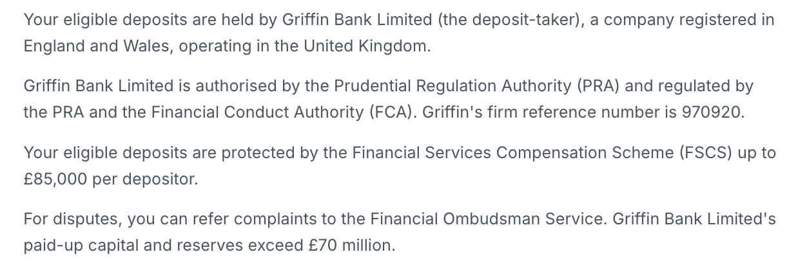

# Xero Accounting for Gift Cards

## Amazon Shopping Gift Cards

***

### Overview

**Conceptually:**\
An Amazon gift card is treated as a **prepaid asset** in Xero.

* When you receive the gift card, you increase a prepaid balance.
* When you purchase items from Amazon, you record the full invoice and apply the gift card as a payment method.
* The accounting category is determined by what you buy — not by the gift card.

***

### Step 1 (One-off) – Create an “Amazon Gift Card” Account

1. In Xero, go to:\
   **Accounting → Chart of accounts → Add Account**
2. Complete the account setup:

* **Account Type:** Current Asset
* **Name:** Amazon Gift Card
* **Tax:** No VAT
* _(Optional)_ Description: “Prepaid Amazon gift card balance”
* Tick **Enable payments to this account** so you can select it when recording bill payments

3. Click **Save**

<figure><figcaption>
Step 1 – Amazon Account set-up
</figcaption></figure>

This account will hold your Amazon gift card balance.

***

### Step 2 – Record the Amazon Gift Card as Received

When you receive an Amazon gift card (e.g. from opening an Amazon Pot):

1. Go to:\
   **Reporting → Journal Report → Go to Manual Journals**
2. Click **New Journal**
3. Enter two lines (replace £50 with your actual voucher amount):

* **Debit:** Amazon Gift Card (Current Asset) — £50 — Tax: No VAT
* **Credit:** Other Income / Incentives (or Other Revenue) — £50 — Tax: No VAT

4. Click **Post**

This:

* Increases your Amazon Gift Card balance
* Recognises the incentive income

***

#### Alternative to Step 2 – Record the Gift Card Using a Bill

Instead of a manual journal, you may use a negative bill.

1. Ensure you have an income account such as: **Other Income – Incentives (No VAT)**
2. Go to:\
   **Purchases → Bills to pay → New Bill**
3. Enter:

* **From:** Stoa Incentive (or similar contact)
* **Date:** Voucher received date
* **Due date:** Same day

4. Add one line:

* **Description:** Amazon voucher received
* **Account:** Other Income – Incentives
* **Amount:** -£50.00
* **Tax rate:** No VAT

5. Approve the bill.
6. Click **Make a payment**:

* **Paid from:** Amazon Gift Card
* **Amount:** £50.00

Result:\
The Amazon Gift Card balance increases without needing a manual journal.

***

### Step 3 – Entering an Amazon Purchase

Each time you buy something from Amazon:

1. Go to:\
   **Purchases → Bills → New Bill**
2. Enter:

* **From:** Amazon
* **Date:** Invoice/order date
* **Due date:** Same day (or as per invoice)
* **Amounts are:** Tax Exclusive (typical if VAT registered)

3. Add line items and code each to the correct account:

Example:

* “Printer paper and stationery” → Office Equipment
* “Wireless keyboard” → Computer Equipment

If VAT registered:

* Apply the VAT rate shown on the invoice (e.g. 20% VAT on Expenses)

4. Click **Approve**

***

### VAT Clarification

Amazon invoices display a VAT-inclusive total.

If VAT registered:

* Enter the net amount in Xero.
* Apply the correct VAT rate.
* Xero calculates VAT separately.

VAT relates to the goods purchased — not the payment method.

If not VAT registered:

* Enter the full invoice amount.
* Select **No VAT**.

***

### Step 4 – Paying the Bill

#### If the Order Total is Less Than or Equal to the Gift Card Balance

1. Open the approved bill.
2. Click **Make a payment**.
3. Select:

* **Paid from:** Amazon Gift Card
* **Amount:** Full invoice total

4. Click **Add Payment**

The bill is now fully paid using the gift card.

***

#### If the Order Total is Greater Than the Gift Card Balance

You will need to create two payments:

**First payment:**

* Paid from: Amazon Gift Card
* Amount: Remaining gift card balance (e.g. £50)
* Click **Add Payment**

**Second payment:**

* Paid from: Bank account / card account
* Amount: Remaining invoice balance
* Click **Add Payment**

Result:

* The full invoice is recorded.
* Part is settled by gift card.
* The remainder is settled via bank.
* Xero clearly shows how much was paid from each source.

***

### If Amazon Gift Card Does Not Appear as a Payment Option

Return to Step 1 and ensure:

* **Enable payments to this account** is ticked on the Amazon Gift Card account.

***

### If You Receive Another Amazon Gift Card

If you open another Amazon Pot and receive an additional voucher:

* Do **not** create a new account.
* Repeat **Step 2** and debit the existing **Amazon Gift Card (Current Asset)** account.
* Continue using that same account to apply payments.

All vouchers accumulate in the same prepaid balance.

***

### Example – Entering Amazon Invoice Data

Given:

* Item subtotal: £29.82
* VAT (20%): £5.96
* Total: £35.78

When creating the bill:

* **From:** Amazon
* **Date:** 3 January 2026
* **Due date:** 3 January 2026
* **Line item:**
  * Description: Wireless keyboard
  * Qty: 1
  * Amount: £29.82
  * Account: 720 – Computer Equipment
  * Tax rate: 20% (VAT on Expenses)

Xero will calculate VAT of £5.96 and a total of £35.78.

If paid entirely by gift card:

* Apply £35.78 from Amazon Gift Card.
* The bill will show as fully paid.

***

### Key Principles

* The gift card is a **prepaid asset**, not a discount.
* Always record the **full supplier invoice**.
* Expense categories are determined by the items purchased.
* VAT treatment is based on the invoice, not how you paid.
* No direct integration between Amazon gift cards and Xero is required.
